# Dear Jacky
Dear Jacky is an Android and smartwatch application and a digital companion. Tell Jacky how you're feeling throughout the day so you can record your emotional fluctuations, reflect on your moods, and better respond to any emotional distress.

[Full Promotional Video](https://youtu.be/4-Ic13FpcX4)

[Short Promotional Video](https://youtu.be/yuxfU6hwqV4)
# Features

## RECORD

Every 6 hours, Jacky will prompt you to enter your mood. You are also able to add a new mood whenever you want.
* Record your current mood on your smartwatch. Choose from four different moods!
* Select the intensity of your mood from a scale of 1 to 5.
* Use voice dictation to add a note.
* On the phone, make a new entry (add a past or current mood) using the pencil tab on the bottom right on the phone screen.
* On the phone, go back to edit past moods by tapping the entry.

## Mobile Interface
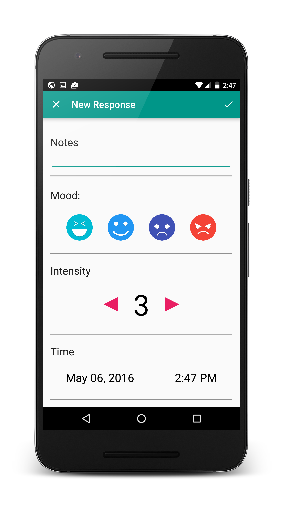
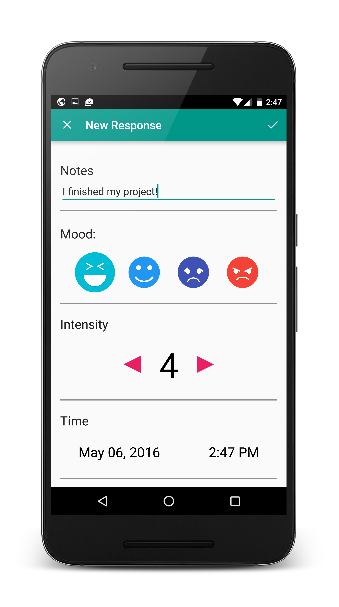
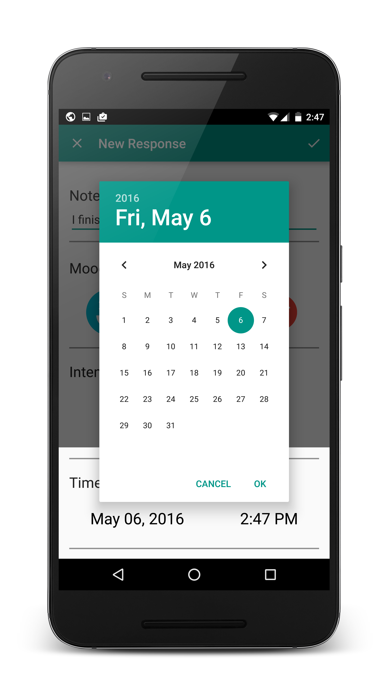
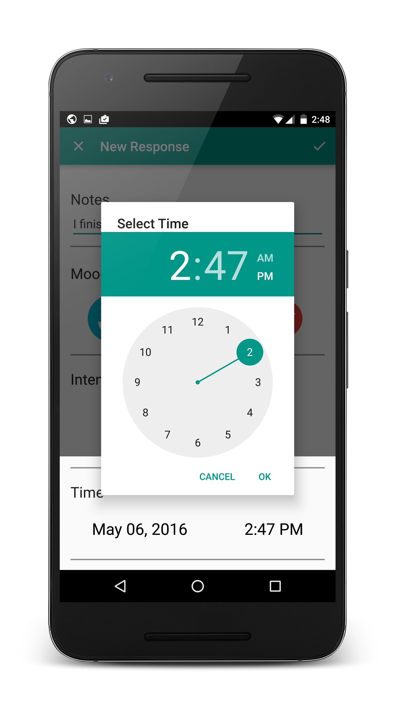
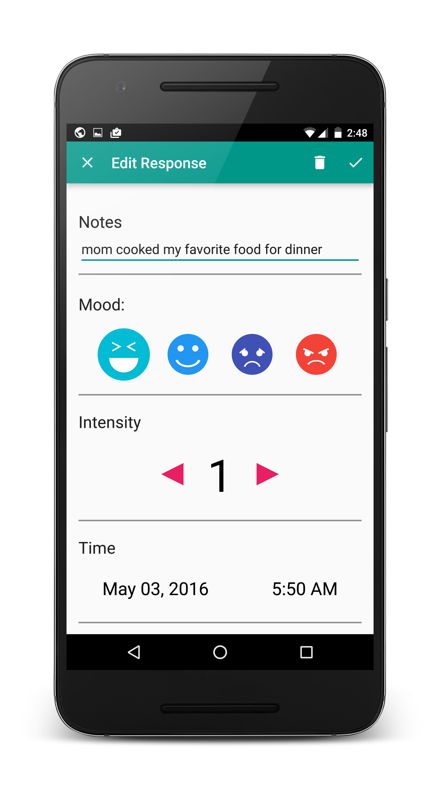

## Android Wear Interface
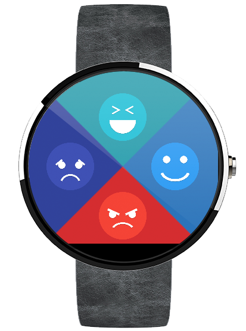
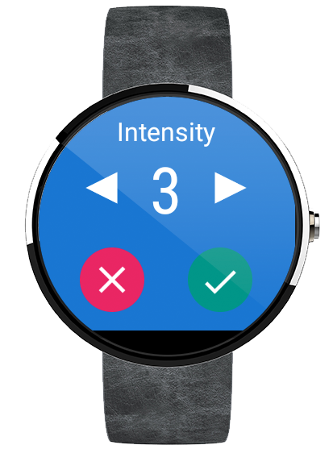
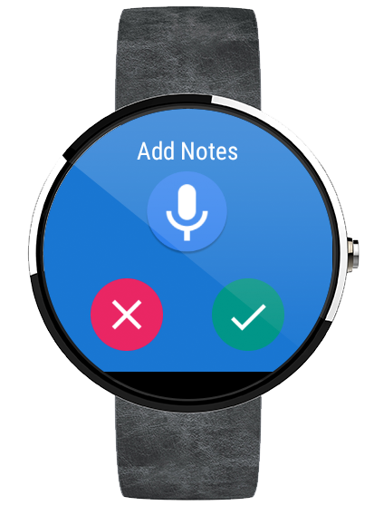
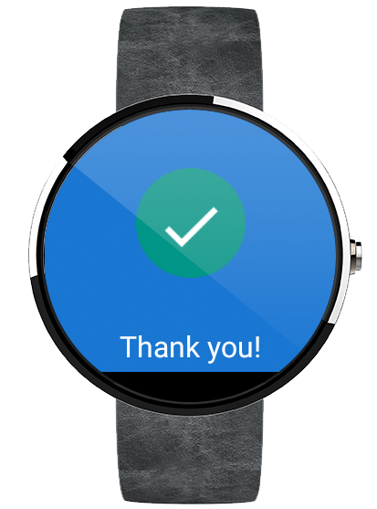

## REFLECT
* See your past moods with a timeline view. Scroll through to see your past moods for each day.
* There is also a month view where you can see the strongest emotion you felt for each day. (Each mood corresponds to a different color.)

# Mobile Interface
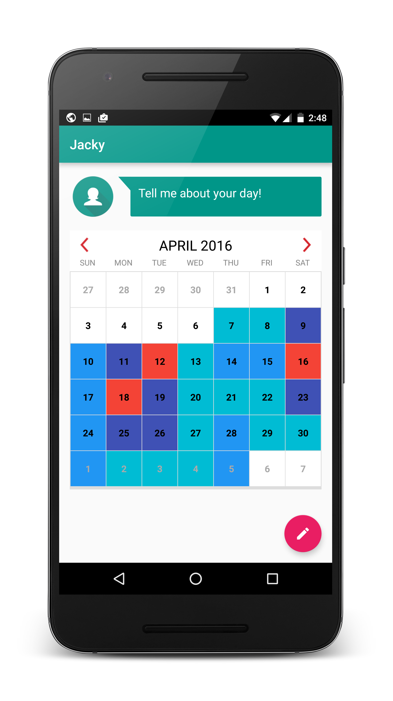
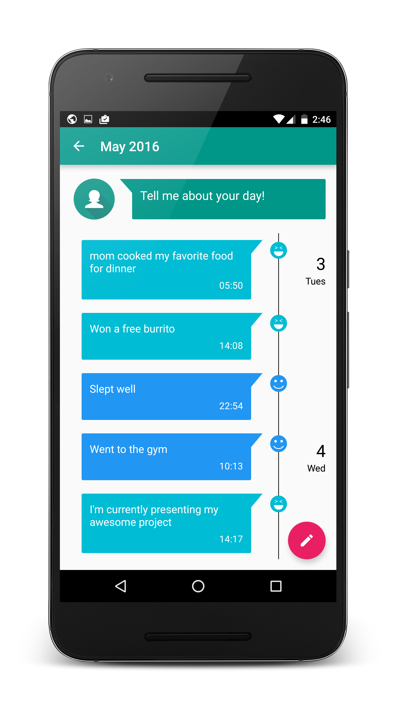

## RESPOND

Using Natural Language Processing, Jacky offers suggestions on how to make yourself happy again based on your past entries that have put you in a good mood.
* View the respond page by tapping Jacky, else viewing the respond page will be prompted if you have mostly sad or angry entries in a given day.
* Tap a keyword on the respond page and it will search for the keyword on Google
* Call your starred contacts straight from the application, because talking to a friend can help!

## Mobile Interface
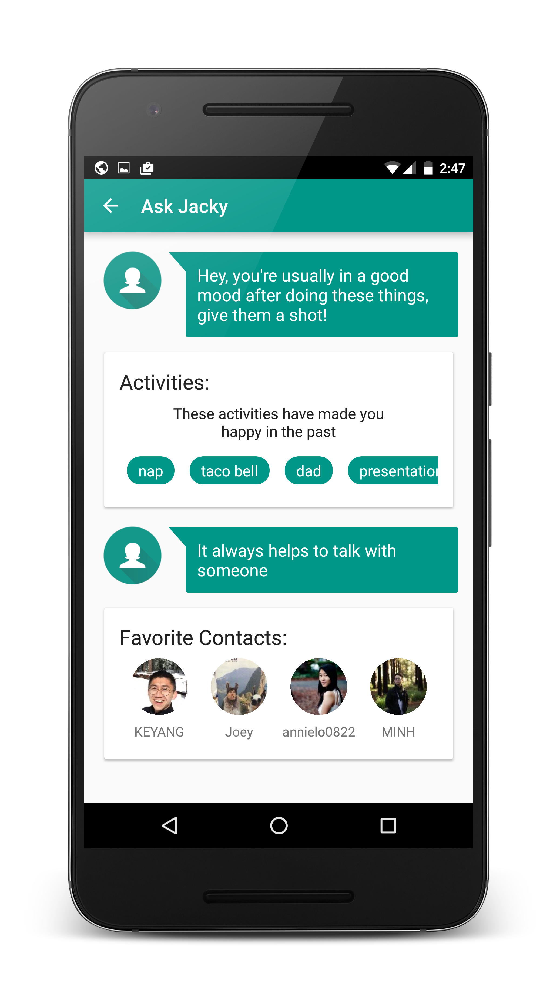

## Debugging
To open this, you should go to your app launcher, and notice that there is a second icon, Dear Jacky Debug. In there you will have a menu that lets you do 3 things:
* Load the dummy database
* Clear the database
* Send notification to the watch

## Contributors
* Jasper Louie
* Akshay Jagadeesh
* Claire Lee
* Kyle Hotchkiss
* Yanrong Li
